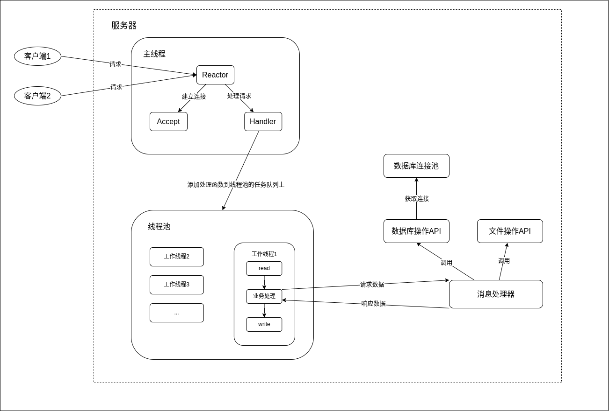

# Netdisk Server

## 目录
* [框架](#框架)
* [JSON库](json/README.md)
* [通信协议](msg/README.md)
* [线程池](threadpool/README.md)
* [数据库连接池](mysql/README.md)
* [数据库操作API](idatabase/README.md)
* [文件/文件夹操作API](ifilefolder/README.md)
* [包裹函数](wrap/README.md)
* [运行环境](#运行环境)

## 框架

**服务器端环境
*操作系统:Ubuntu 22.04.4 LTS
*核心依赖: libevent 2.1.12, MySQL客户端库 8.0.37
*编译器: GCC/G++ (C++20支持)
*数据库: MySQL 8.0+

**客户端环境
*操作系统:Ubuntu 22.04.4 LTS
*UI框架: Qt 6.2.3+ (Core, GUI, Widgets, Network)
*编译标准: C++17。
[<--](../README.md)
